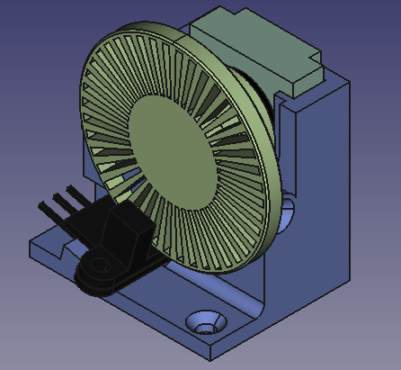

Smart Filament Sensor
===

The project describes how to make by your own pretty smart filament sensor for your 3D printer.

For getting more information please see [doc/README](doc/README.md) file

