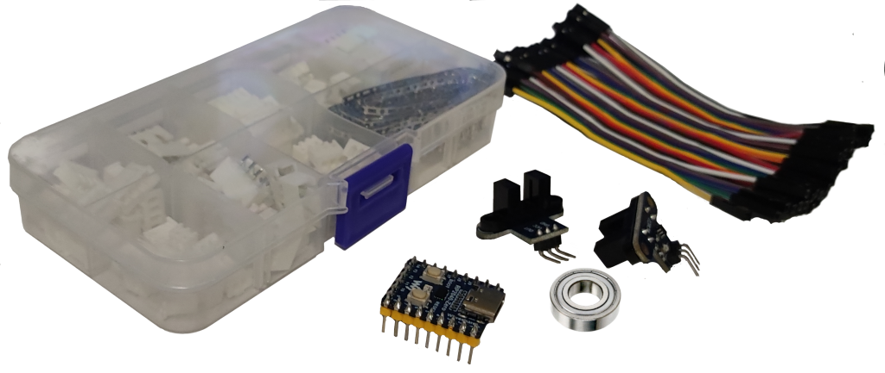

About
===

The Smart Filament Sensor it's just my attempt to implement fully backward compatible sensor with my 'Creality CR10 Smart' 3D printer. I know about existing smart sensors, but almost all of these sensors require flashing by own-compiled firmware with changing sensor settings. In general, I like to upgrade firmwares by usual way from 'Creality support' site, so the project should replace stock filament sensor by little bit smarter without touching the firmware.

Main idea
---

So, there is a stock sensor for my printer:

The sensor is very simple: has just a microswitch inside and has only one function: to alarm if the microswitch isn't pressed  by a filament. In general, it's okay, but there are few cases when it isn't enough:

- The filament may stuck for some reasons. Eg. it may be get tangled in a coil before a sensor or it may be deformed and jammed by feed gear in extruder due to a lot of retractions in small amount of time.
- A diameter of the filament may be unstable (especially for self-made filaments like in my case). Or the filament may be severely bent or dented. In this case  microswitch may be switched off due to insufficient filament pressure on the lever and your 3D-printer may think that filament ended, and the printer stucks until you pass 'Changing filement' ceremony. 

So for detecting not only 'filament ended' events, need to recognize only one case: extruder works but filament doesn't move. This case covers all what I need, include 'filament ended' event. And my Smart Filament Sensor recognizes exactly this case.

Prerequirements
===

The Smart Filament Sensor has two movement sensors: one for a filament, and second one - for a motor in extruder. Stock extruder looks like:

With this extruder we don't have ability to access to motor shaft (as we need to recognize rotation) - the motor shaft is placed inside fully closed box. So in my case, I've replaced the stock extruder by this:

If you want to buy the same extruder, you may search it in Internet by '[dual gear extruder](https://www.google.com/search?q=dual+gear+extruder)' query. 

The extruder gives us an access to the top of a motor shaft so now it's possible to recognize a rotation of the motor by Smart Filament Sensor.

Requirements
===

Hardware
---

In general, all what I bought is:

- RP2040-Zero
- Two movement optical sensors
- a set of wires
- XH2,54 Connector Terminal Kit... to be honest, I only need one 3pin 'mother' connector but it's hard to find just one, so it's easy to buy a kit... maybe it will come in handy in my other projects, yeah

All these stuff I bought on AliExpress. I don't sure is it makes sence to post links here as these links may be outdated and you might end up with funny '404 not found' page... but there are links nonetheless:
- https://pl.aliexpress.com/item/32735930193.html
- https://pl.aliexpress.com/item/1005004310502426.html
- https://pl.aliexpress.com/item/32909050779.html
- https://pl.aliexpress.com/item/1005004281549886.html

If any of the links don't work, please let me know via a pull request, huh.

In additional, it would be great if you knew a little about the soldering iron...

And, of course, it would be great if you had a 3D printer as some parts of this project need to be 3D printed.

Software
---

If you only want to assembly the Smart Filament Sensor, then you don't need any additional software. Download only the [latest releases](../releases/)  files and follow step-by-step instruction.

If you want to contribute the project (eg, if you want to improve existing source codes or to add support of STM32 or Arduino boards), please follow [Development](Development.md) instructions

Step-by-step instruction
===

to be continued...

