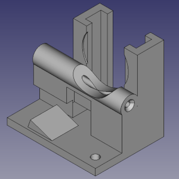
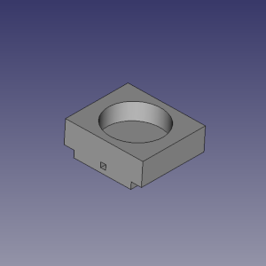
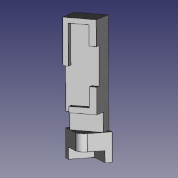
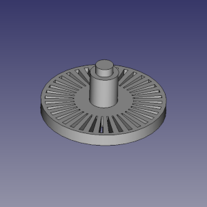
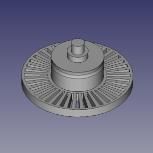
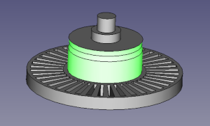
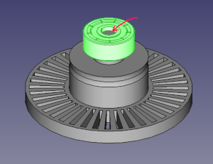
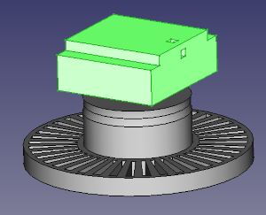

Step-by-step instruction
===
I suppose, you have bought all needed stuff and downloaded all needed files from the project at this moment, isn't it? If no - please read the [manual](README.md) again more carefully... :)

So first step is: to 3D-print all parts of the SmartFilamentSensor. I  printed these parts by 0.4 mm nozzle:

and these parts were printed by 0.2 mm nozzle for greater accuracy: 

Next, cut by scissors a rubber ring from latex medical gloves:

stretch the rubber ring over the highlighted surface of sensor wheel:

this is necessary to prevent filament slippage and better friction.

Put a bearing on the filament wheel. I also put a drop of superglue here, just in case:

Put the bearing into the wheel suport:

