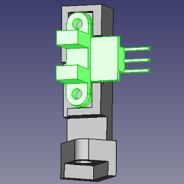

Step-by-step instruction
===
I suppose, you have bought all needed stuff and downloaded all needed files from the project at this moment, isn't it? If no - please read the [manual](README.md) again more carefully... :)

3D prining
---

So first step is: to 3D-print all parts of the SmartFilamentSensor. I  printed these parts by 0.4 mm nozzle:

and these parts were printed by 0.2 mm nozzle for greater accuracy: 

Assembling parts
---

Cut by scissors a rubber ring from latex medical gloves:

Stretch the rubber ring over the highlighted surface of sensor wheel:

this is necessary to prevent filament slippage and better friction.

Put a bearing on the filament wheel. I also put a drop of superglue here, just in case:

Put the bearing into the wheel suport:

Put one of sensors into main body:

Put a wheel with support into main body:

Connect wheel support and main body via rubber ring and wires... well, I don't know how I may draw it, so there is a photo of my sensor:

As you can see, the rubber is stretched and fixed by twisted wires on the support and the body through the holes. Of course, you may use a spring if you have appropriate size, but I don't have one, so  I use a rubber ring and disposable packing wire (peeled of any plastic sheath).

Put second movement sensor on the engine body. You may use a drop of thermoglue or super-glue for this:

Soldering
---
Well, frankly speaking, soldering is optional and you may use wires with connectors, but from my point of view, it may produce a lot of issues with connections and as result, incorrect and unstable behaviour of SmartSensor... so I'd like to prefer soldering.

Connect all elements regarding to the scheme:

Flashing firmware
---
Connect RP2040Zero to your PC via USB cable. Press 'RESET' button on the plate, don't release the button and press 'BOOT' button so you should have two buttons pressed. Release 'RESET' button and next release 'BOOT' button. f you did everything correctly, your RP2040Zero will be visible for your PC as an USB flash drive. Copy firmware bin-file to the 'usb stick'. After it, the drive will be disconnected and firmware successfully flashed to the plate.

Final steps
---
On the final step, need to put Engine wheel on a motor shaft and put 'engine sensor body' with a sensor to body of extruder using few drop of superglue. It should looks like:

